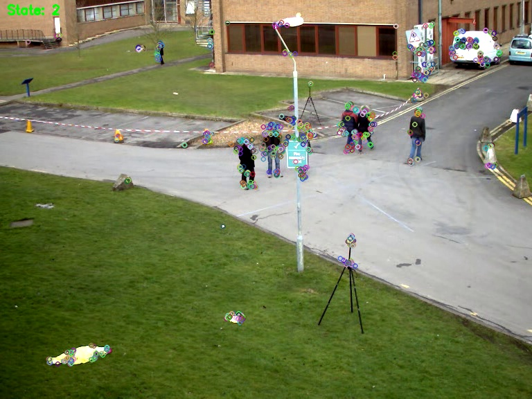

# SimpleVisualSLAM

C++17で実装された最小限の単眼Visual SLAM実装。

## ライセンス

MIT License.

## 依存関係

- **OpenCV** (必須)
- **Ceres Solver** (必須 - 最適化フェーズで有効化)
- **Sophus** (必須)
- **DBoW2** (必須 - Loop Closure用)

## ビルド

```bash
mkdir build
cd build
cmake ..
make
```

## 使用方法

```bash
# ビデオファイルの場合
./run_mono path/to/video.mp4 [vocab_path]

# EuRoC dataset の場合（正攻法: 画像列 + timestamps + intrinsics）
./run_mono --euroc /path/to/MH_01_easy [vocab_path]

# カメラの場合 (ID指定)
./run_mono 0
```

### サンプル実行

リポジトリにはサンプル動画 `tree.avi` (OpenCV sample) を使用した実行結果が含まれています。

```bash
./run_mono tree.avi
```

実行後、`slam_result.jpg` が生成されます。

### EuRoC dataset

Tracking / Mapping のデバッグには、カメラ内パラとタイムスタンプが付属する EuRoC の利用を推奨します。

- https://projects.asl.ethz.ch/datasets/doku.php?id=kmavvisualinertialdatasets

#### フォルダ構成（例）

`--euroc` にはシーケンス直下（例: `MH_01_easy`）を渡してください。

```
MH_01_easy/
  mav0/
    cam0/
      sensor.yaml
      data.csv
      data/
        1403636579763555584.png
        ...
```

この実装は `mav0/cam0` のみを読み込みます（単眼）。

## ORB Vocabulary

ループクロージャ（DBoW2）を有効化するには ORB の語彙ファイル（例: `ORBvoc.txt`）が必要です。

このリポジトリでは語彙ファイルは配布しません。各自で入手して `data/ORBvoc.txt` に配置してください。

例（ORB-SLAM2 配布の語彙）:

- https://github.com/raulmur/ORB_SLAM2

### ダウンロード例（Linux）

以下は ORB-SLAM2 の配布物から `ORBvoc.txt` を取得して `data/ORBvoc.txt` に配置する例です。

```bash
mkdir -p data
curl -L -o ORBvoc.txt.tar.gz https://github.com/raulmur/ORB_SLAM2/raw/master/Vocabulary/ORBvoc.txt.tar.gz
tar -xzf ORBvoc.txt.tar.gz -C data
```

上記で `data/ORBvoc.txt` が作成されます。

デフォルトでは `data/ORBvoc.txt`（存在すれば）を読み込みます。別パスを使う場合は第2引数で指定してください。

### 実行結果例



## 機能 (計画)

- [x] 基本データ構造 (Frame, Keyframe, Map, Camera)
- [x] ORB特徴抽出
- [ ] トラッキング (等速運動モデル, 参照KF)
- [ ] 初期化 (単眼)
- [ ] 局所マッピング (Local BA)
- [ ] ループクロージャ (DBoW2 + Pose Graph)
- [ ] マップ保存/読み込み
