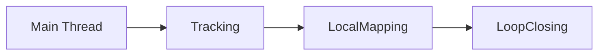

# SimpleVisualSLAM
> A readable, hackable Visual SLAM in 6k lines of C++17

[](https://github.com/rsasaki0109/simple_visual_slam/actions/workflows/ci.yml)

SimpleVisualSLAM is a compact BSD-licensed Visual SLAM system for people who want to read the whole pipeline, modify it, and run experiments without living inside a 50k-line codebase. It supports monocular, RGB-D, stereo, and learned-depth inputs, with loop closing, map persistence, and a ROS2 Jazzy node.

## Feature Highlights

- 6k lines of readable C++17 (vs ORB-SLAM3's 50k)
- Mono / RGB-D / Stereo / DL Depth
- Loop closing with pose graph optimization
- ROS2 Jazzy node included
- BSD-2-Clause license (no GPL contamination)
- 55 unit tests, CI with regression gates

## Quick Start

```bash
# Clone and build
git clone https://github.com/rsasaki0109/simple_visual_slam.git
cd simple_visual_slam
sudo apt install -y libopencv-dev libeigen3-dev libgoogle-glog-dev libgflags-dev libsuitesparse-dev
cmake -S . -B build -G Ninja -DBUILD_TESTS=ON
cmake --build build -j$(nproc)
ctest --test-dir build

# Run on TUM dataset
./build/run_mono --tum <path-to-tum-sequence> --depth --no-viz
```

The first configure fetches Ceres Solver, Sophus, DBoW2, and GoogleTest automatically. The full `-DUSE_DEPTH_DL=ON` build reaches the 55-test configuration.

## Supported Modes

| Mode | Input | Flag |
| --- | --- | --- |
| Mono | RGB camera | (default) |
| RGB-D | RGB + Depth | `--depth` |
| Stereo | Stereo pair | `--euroc --stereo` |
| DL Depth | RGB + ONNX model | `--depth-model` / `--metric-depth-model` |

Stereo is currently available through the EuRoC loader. DL depth requires `-DUSE_DEPTH_DL=ON`. For the full flag set, run `./build/run_mono --help`.

## Architecture


```mermaid
flowchart LR
    A[Main Thread] --> B[Tracking]
    B --> C[LocalMapping]
    C --> D[LoopClosing]
```

Tracking runs on the main thread. Local mapping and loop closing process keyframes asynchronously and push corrections back into the shared map.

## Accuracy

Absolute Trajectory Error (ATE) mean in meters with Sim(3) alignment. These are the current regression-gate snapshot numbers.

| Sequence | Mono | RGB-D | RGB-D + Accel |
| --- | ---: | ---: | ---: |
| Seq A (small motion) | 0.0223 | 0.0109 | 0.0110 |
| Seq B (room-scale) | 0.2688 | 0.1289 | 0.2350 |

### Comparison with `stella_vslam`

On the same TUM head-250 windows and `evo_ape` settings, `stella_vslam` currently beats SimpleVisualSLAM in all four measured scenarios. Loop closing did not materially close the gap in this comparison.

| Scenario | Mode | SimpleVisualSLAM (`--repro-eval`) | SimpleVisualSLAM (loop median, 3 runs) | `stella_vslam` (head-250) | Winner |
| --- | --- | ---: | ---: | ---: | --- |
| `xyz_depth` | RGB-D | 0.01137 | 0.01140 | 0.00889 | `stella_vslam` |
| `xyz_mono` | Mono | 0.04828 | 0.04530 | 0.01414 | `stella_vslam` |
| `room_depth` | RGB-D | 0.08607 | 0.08256 | 0.02111 | `stella_vslam` |
| `room_mono` | Mono | 0.19982 | 0.20024 | 0.02744 | `stella_vslam` |

The comparison uses the first `250` poses from the provided `stella_vslam` trajectories, which is the fairest head-window available from the supplied artifacts. If you compare against other systems, keep the dataset window, modality, and `evo_ape` flags identical. See [eval/comparison_protocol.md](eval/comparison_protocol.md).

## Optional Extras

### ORB Vocabulary for Loop Closing

Loop closing looks for `data/ORBvoc.txt`. If it is missing, the system still runs, but loop closing is disabled.

```bash
mkdir -p data
curl -L -o ORBvoc.txt.tar.gz \
    https://github.com/raulmur/ORB_SLAM2/raw/master/Vocabulary/ORBvoc.txt.tar.gz
tar -xzf ORBvoc.txt.tar.gz -C data
rm ORBvoc.txt.tar.gz
```

### DL Depth

Build with `-DUSE_DEPTH_DL=ON`, then pass either `--depth-model <model.onnx>` or `--metric-depth-model <model.onnx>`. Depth Anything v2 works out of the box via ONNX Runtime.

### ROS2 Jazzy

A ROS2 node and launch file live under [`ros2/`](ros2/). See [`ros2/README.md`](ros2/README.md) for workspace build and launch instructions.

## Contributing

Contributions are welcome. Start with [CONTRIBUTING.md](CONTRIBUTING.md), keep changes small and reviewable, and run `ctest --test-dir build --output-on-failure` before opening a PR. If you touch evaluation logic, keep the regression scripts and benchmark docs in sync.

## Citation

For papers and reports, please cite the repository (GitHub also reads [`CITATION.cff`](CITATION.cff)). Example BibTeX:

```bibtex
@software{simple_visual_slam,
  title        = {SimpleVisualSLAM},
  year         = {2026},
  publisher    = {GitHub},
  howpublished = {\url{https://github.com/rsasaki0109/simple_visual_slam}},
  license      = {BSD-2-Clause},
  version      = {0.1.0},
  note         = {For reproducibility, record the git commit and run ./build/run_mono --version.}
}
```

## License

This project is licensed under the [BSD 2-Clause License](LICENSE).

## Acknowledgements

SimpleVisualSLAM builds on the following open source projects:

- [OpenCV](https://opencv.org/) for feature extraction, image processing, and visualization
- [Ceres Solver](http://ceres-solver.org/) for bundle adjustment and nonlinear optimization
- [Sophus](https://github.com/strasdat/Sophus) for Lie group (`SE3` / `Sim3`) operations
- [DBoW2](https://github.com/dorian3d/DBoW2) for bag-of-words place recognition
- [ONNX Runtime](https://onnxruntime.ai/) for deep learning inference
- [Depth Anything v2](https://github.com/DepthAnything/Depth-Anything-V2) for monocular depth estimation
