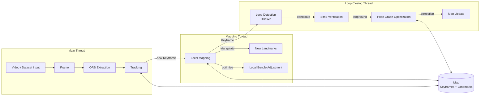

# SimpleVisualSLAM

[](https://github.com/rsasaki0109/simple_visual_slam/actions/workflows/ci.yml)

A lightweight, readable visual SLAM system with deep learning depth integration.

## Features

- **Monocular visual SLAM** with ORB feature extraction and matching
- **Depth sensor integration** -- single-frame initialization and depth-assisted bundle adjustment
- **Deep learning depth estimation** -- Depth Anything v2 via ONNX Runtime for metric-scale monocular operation
- **Accelerometer integration** -- gravity-aligned coordinate frames and stationary detection
- **Loop closing** -- DBoW2 place recognition with Sim(3) pose graph optimization
- **Map persistence** -- save and load maps for relocalization across sessions
- **~6,000 lines of C++** -- designed to be readable and educational rather than maximally optimized
- **BSD-2-Clause license** -- all dependencies are GPL-free

## Architecture


```mermaid
flowchart LR
    subgraph Main Thread
        A[Video / Dataset Input] --> B[Frame]
        B --> C[ORB Extraction]
        C --> D[Tracking]
    end

    subgraph Mapping Thread
        D -- new Keyframe --> E[Local Mapping]
        E -- triangulate --> F[New Landmarks]
        E -- optimize --> G[Local Bundle Adjustment]
    end

    subgraph Loop Closing Thread
        E -- Keyframe --> H[Loop Detection<br/>DBoW2]
        H -- candidate --> I[Sim3 Verification]
        I -- loop found --> J[Pose Graph Optimization]
        J -- correction --> K[Map Update]
    end

    D <--> L[(Map<br/>Keyframes + Landmarks)]
    E <--> L
    J <--> L
```

**Data flow summary:**
1. Each incoming image is converted into a `Frame` with ORB keypoints and descriptors.
2. **Tracking** estimates the camera pose by matching against the local map (constant-velocity model, then reference keyframe, then local map tracking).
3. When a new keyframe is created, the **Local Mapping** thread triangulates new landmarks and runs local bundle adjustment via Ceres Solver.
4. The **Loop Closing** thread queries the DBoW2 database for place-recognition candidates, verifies them with Sim(3) alignment, and distributes the accumulated drift across the pose graph.

## Results

Absolute Trajectory Error (ATE) mean in meters, evaluated with Sim(3) alignment. The table below is a single-run snapshot; for repeated evaluation, run `bash scripts/eval_all.sh --repeat N` to export aggregate `mean/std` summaries into `eval_results/summary.txt`.

| Sequence | Monocular | + Depth | + Depth + Accel |
|---|---|---|---|
| Seq A (small motion) | 0.023 | 0.011 | 0.011 |
| Seq B (room-scale) | 0.845 | 0.227 | 0.235 |

Depth sensor integration significantly improves metric-scale accuracy. Accelerometer data provides gravity alignment and helps with stationary detection but shows marginal improvement when depth is already available.

## Experiment Status

The reference-keyframe policy work now lives as a compareable experiment surface rather than a one-off implementation tweak.

- GitHub landing page: [docs/index.md](docs/index.md)
- Decision record: [docs/decisions.md](docs/decisions.md)
- Full experiment tables: [docs/experiments.md](docs/experiments.md)
- Minimal surviving interface: [docs/interfaces.md](docs/interfaces.md)

Current snapshot:

- Curated corpus accuracy: `score` and `pipeline` tie at `0.929`
- Bounded real-trace replay: `score` is the current overall best
- Full repeat-2 replay: `score` stays best overall, but no single policy wins every mode
- Runtime default remains `heuristic` until one policy wins across curated, replay, and repeat gates

**Local regression gate (data required):** With TUM sequences under `data/tum/` (see `eval/regression_baselines.json`) and `evo_ape` installed, run `python3 scripts/check_regression_gate.py --quiet` from the repo root. This checks `--repro-eval` bitwise trajectory match on two runs and compares mean ATE (same `evo_ape` flags as `scripts/eval_reference_policies.sh`) to per-scenario ceilings. Use `--all-gates` to run every scenario in the JSON, `--gate <name>` for one scenario, and `--skip-ate` for reproducibility only.

**Ceres parallelism:** Bundle adjustment and pose-graph solves default to **one thread** for repeatable results. For faster (possibly run-to-run variable) solves, set e.g. `export SVSLAM_CERES_NUM_THREADS=8` before running `run_mono`.

## Dependencies

**Required:**
- [OpenCV](https://opencv.org/) 4.5+
- [Eigen3](https://eigen.tuxfamily.org/)

**Auto-fetched via CMake FetchContent (no manual installation needed):**
- [Ceres Solver](http://ceres-solver.org/) 2.1+
- [Sophus](https://github.com/strasdat/Sophus) (Lie group library)
- [DBoW2](https://github.com/dorian3d/DBoW2) (bag-of-words for loop closing)

**Optional (auto-fetched when enabled):**
- [ONNX Runtime](https://onnxruntime.ai/) (for deep learning depth estimation)

## Build

Tested on Ubuntu 22.04 with GCC 11+.

```bash
# Install system dependencies
sudo apt install libopencv-dev libeigen3-dev libgoogle-glog-dev libgflags-dev

# Build
mkdir build && cd build
cmake ..
make -j$(nproc)
```

The first build may take several minutes as CMake fetches and compiles Ceres Solver, Sophus, and DBoW2 automatically.

### Build Options

| CMake Option | Default | Description |
|---|---|---|
| `USE_DBOW2` | `ON` | Enable DBoW2 for loop closing |
| `USE_DEPTH_DL` | `OFF` | Enable deep learning depth estimation (fetches ONNX Runtime) |

Example with all features enabled:

```bash
cmake .. -DUSE_DEPTH_DL=ON
make -j$(nproc)
```

### Repeated Evaluation

```bash
bash scripts/eval_all.sh --repeat 5
```

This runs each dataset/mode pair five times, keeps per-run trajectories and logs in `eval_results/`, and writes aggregate `mean/std` ATE statistics to `eval_results/summary.txt`.

## Usage

### Video File

```bash
./build/run_mono path/to/video.mp4
```

### Image Sequence Dataset

```bash
# EuRoC-format dataset (cam0/data/ with timestamps)
./build/run_mono --euroc /path/to/sequence_dir

# TUM RGB-D format dataset
./build/run_mono --tum /path/to/sequence_dir
```

### With ORB Vocabulary (enables loop closing)

```bash
# Vocabulary path as last argument
./build/run_mono path/to/video.mp4 data/ORBvoc.txt
./build/run_mono --euroc /path/to/sequence_dir data/ORBvoc.txt
./build/run_mono --tum /path/to/sequence_dir data/ORBvoc.txt
```

If no vocabulary path is given, the system looks for `data/ORBvoc.txt` by default. If the file is not found, loop closing is disabled and the system runs without it.

### Output

- **`trajectory.txt`** -- estimated camera trajectory (timestamp, x, y, z)
- **`map.bin`** -- serialized map for later reuse

### Keyboard Controls

- `Esc` -- stop processing

## ORB Vocabulary

Loop closing requires an ORB vocabulary file. This repository does not distribute one. You can obtain `ORBvoc.txt` from the ORB-SLAM2 project:

```bash
mkdir -p data
curl -L -o ORBvoc.txt.tar.gz \
    https://github.com/raulmur/ORB_SLAM2/raw/master/Vocabulary/ORBvoc.txt.tar.gz
tar -xzf ORBvoc.txt.tar.gz -C data
rm ORBvoc.txt.tar.gz
```

This places the vocabulary at `data/ORBvoc.txt`, which is the default search path.

## Deep Learning Depth Estimation

SimpleVisualSLAM can use [Depth Anything v2](https://github.com/DepthAnything/Depth-Anything-V2) to predict dense depth maps from monocular images via ONNX Runtime. This enables metric-scale reconstruction without a physical depth sensor.

### Download the ONNX Model

```bash
mkdir -p models
# Download Depth Anything v2 Small (recommended for real-time use)
wget -O models/depth_anything_v2_small.onnx \
    https://huggingface.co/onnx-community/depth-anything-v2-small/resolve/main/onnx/model.onnx
```

### Build with DL Depth

```bash
mkdir build && cd build
cmake .. -DUSE_DEPTH_DL=ON
make -j$(nproc)
```

### Run with DL Depth

```bash
./build/run_mono --depth-model models/depth_anything_v2_small.onnx path/to/video.mp4
```

When enabled, the system runs depth inference on each keyframe and uses the predicted depth to:
- Initialize the map from a single frame (no two-view initialization required)
- Add depth priors to bundle adjustment for improved scale consistency

## Project Structure

```
SimpleVisualSLAM/
├── apps/
│   └── run_mono.cc            # Main application entry point
├── src/
│   ├── core/                  # Camera, Frame, Keyframe, Landmark, Map
│   ├── tracking/              # Tracking, Initializer
│   ├── backend/               # Local Mapping, Bundle Adjustment (Ceres)
│   ├── loop_closing/          # Loop detection + Sim3 pose graph optimization
│   └── io/                    # Dataset readers, Map serialization
├── cmake/                     # CMake modules
└── CMakeLists.txt
```

## License

This project is licensed under the [BSD 2-Clause License](LICENSE).

## Acknowledgements

SimpleVisualSLAM builds on the following open source projects:

- [OpenCV](https://opencv.org/) -- feature extraction, image processing, visualization
- [Ceres Solver](http://ceres-solver.org/) -- bundle adjustment and nonlinear optimization
- [Sophus](https://github.com/strasdat/Sophus) -- Lie group (SE3/Sim3) operations
- [DBoW2](https://github.com/dorian3d/DBoW2) -- bag-of-words place recognition for loop closing
- [ONNX Runtime](https://onnxruntime.ai/) -- deep learning inference for depth estimation
- [Depth Anything v2](https://github.com/DepthAnything/Depth-Anything-V2) -- monocular depth estimation model
