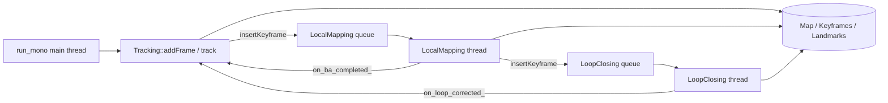

# SimpleVisualSLAM Agent Handoff

This file is the authoritative handoff for Codex / Claude / Cursor as of **2026-04-15**.
It was rewritten from scratch using current command output from this workspace:

- `git log --oneline -20`
- `git diff --stat HEAD~16..HEAD`
- `ctest --test-dir build_codex --output-on-failure`
- `cat eval/stella_comparison_results.md`
- `cat eval/metric_depth_test_results.md`
- `cat eval/euroc_test_results.md`
- `wc -l src/**/*.cc src/**/*.h apps/*.cc`
- `ls tests/test_*.cc`
- `cat eval/regression_baselines.json`
- `./build_codex/run_mono --version`
- `./build_codex/run_mono --help`

If this document and the code disagree, the code is correct and this file should be updated.

---

## 1. Vision

**Readable SLAM** remains the core goal:

- a compact, BSD-licensed Visual SLAM system
- C++17 end to end
- easy to read, modify, benchmark, and extend
- one repository covering monocular SLAM, RGB-D, stereo depth, learned depth, loop closing, and lightweight robotics integration

The old tagline was "6k lines of C++17". That was true earlier in the project, but it is no longer literally true. The current measured count for `apps/*.cc` plus the requested `src/**/*.cc` and `src/**/*.h` files is **9715 lines**. The right updated statement for v0.2.0 is:

> **SimpleVisualSLAM is still small enough for one AI agent to understand end to end, but now large enough to cover mono, RGB-D, stereo, learned depth, loop closing, map I/O, and ROS2.**

What the project is trying to become:

- **Accuracy/stability target:** reach `stella_vslam`-class behavior on TUM head-250 and room revisit scenarios
- **Differentiator:** keep the learned-depth path first-class instead of bolted on
- **Engineering constraint:** stay BSD-friendly and keep Ceres/Sophus/OpenCV as the main stack; do not take a GPL shortcut unless explicitly approved
- **Research constraint:** every claimed improvement must be tied to a reproducible command and a recorded number

---

## 2. Current State (2026-04-16)

### 2.1 Snapshot

| Item | Current value |
| --- | --- |
| HEAD | run `git rev-parse --short HEAD` |
| HEAD subject | `Improve mono room ATE; pose graph backbone; diagnostics` |
| Version | `SimpleVisualSLAM 0.2.0` |
| Build used for this snapshot | `build_codex` |
| Recent change volume | `73 files changed, 7646 insertions(+), 1269 deletions(-)` in `HEAD~16..HEAD` |
| Unit tests | `58/58` passed |
| `ctest` wall time | `6.94 sec` |
| Core app/source LOC | `9715` lines across `apps/*.cc` + requested `src/**/*.cc` + `src/**/*.h` |
| Test source files | `16` `tests/test_*.cc` files |

### 2.2 Supported Feature Matrix

| Feature | Status | Evidence |
| --- | --- | --- |
| Monocular SLAM | Implemented | `run_mono --tum ...` and default video path |
| RGB-D SLAM | Implemented | `--depth` |
| Accelerometer prior | Implemented | `--accel`; gravity prior in BA |
| EuRoC mono loader | Implemented | `--euroc <sequence_dir>` |
| EuRoC stereo depth | Implemented | `--euroc ... --stereo` |
| Stereo tracking mode | Partial | stereo depth is computed from `cam0+cam1`, but tracking still runs on `cam0` |
| Relative DL depth | Implemented | `--depth-model <model.onnx>` with `-DUSE_DEPTH_DL=ON` |
| Metric DL depth | Implemented | `--metric-depth-model <model.onnx>` with `-DUSE_DEPTH_DL=ON` |
| Loop closing | Implemented | enabled in async runs when ORB vocabulary exists |
| Deterministic replay mode | Implemented | `--repro-eval` disables loop closing and runs local mapping synchronously |
| Map persistence | Implemented | writes `map.bin`, `trajectory.txt`, `trajectory_online.txt`, `trajectory_keyframes.txt` |
| Run summary JSON | Implemented | `--run-summary-json <path>` |
| Strict failure exit | Implemented | `--strict-exit` |
| ROS2 Jazzy node | Implemented, basic | `ros2/src/slam_node.cc`; currently no loop-closing parity |

### 2.3 CLI Surface

`./build_codex/run_mono --help` currently exposes:

- `--version`, `--help`
- `--euroc <sequence_dir>`
- `--tum <sequence_dir>`
- `--euroc-camera-config <calib.json>`
- `--stereo`
- `--tum-camera-config <calib.json>`
- `--depth`
- `--accel`
- `--repro-eval`
- `--reference-policy <heuristic|score|pipeline>`
- `--skip-frames N`
- `--max-frames N`
- `--depth-model <model.onnx>`
- `--metric-depth-model <model.onnx>`
- `--no-viz`
- `--run-summary-json <path>`
- `--keyframe-trace-csv <path>`
- `--strict-exit`

The ORB vocabulary is the last positional argument, otherwise the app searches `data/ORBvoc.txt` and then `ORBvoc.txt`.

### 2.4 Regression Gates

These are the **current measured values** from this workspace on **2026-04-16** (`python3 -u scripts/check_regression_gate.py --build build_codex --all-gates --quiet`).

| Gate | Mode | Mean ATE (m) | Ceiling (m) | Status |
| --- | --- | ---: | ---: | --- |
| `room_depth_accel_head_repro` | RGB-D + accel | `0.057702` | `0.145000` | PASS |
| `room_depth_head_repro` | RGB-D | `0.079914` | `0.165000` | PASS |
| `room_mono_head_repro` | Mono | `0.197374` | `0.340000` | PASS |
| `xyz_depth_head_repro` | RGB-D | `0.011042` | `0.016000` | PASS |
| `xyz_mono_head_repro` | Mono | `0.028136` | `0.030000` | PASS |

Current gate summary on `build_codex`:

- **5/5 gates passing**
- **Current mono focus:** `room_mono_head_repro` is still the weakest head-250 gate by a wide margin

This is the most important delta versus older planning notes. The earlier `xyz_mono_head_repro` blocker has been recovered on the current build, but the pass margin is still thin and `room_mono` remains far from the external baseline.

### 2.5 `stella_vslam` Comparison Status

Important nuance:

- the **Fair Head-250** SimpleVisualSLAM rows in `eval/stella_comparison_results.md` were refreshed on **2026-04-15** (`2ac7ffa`, `scripts/verify_comparison_benchmark.sh`, `BUILD=build_codex`); **`stella_vslam` baselines** in that table are still the original fair-window numbers from `stella_eval`
- **lower sections** of the same markdown file (loop-enabled median runs, 600-frame triplets, covis-weight notes, etc.) are **historical snapshots** unless explicitly re-run
- machine-readable partner: `eval/stella_comparison.json` (updated for the fair table on the same date)

Fixed `stella_vslam` head-250 baselines from `eval/stella_comparison_results.md`:

- `xyz_depth`: `0.00889256 m`
- `xyz_mono`: `0.01413570 m`
- `room_depth`: `0.02110508 m`
- `room_mono`: `0.02743546 m`

Best-known / current SimpleVisualSLAM numbers to compare against them:

| Scenario | SimpleVisualSLAM number | Source | Gap vs `stella_vslam` |
| --- | ---: | --- | ---: |
| `xyz_depth` | `0.011042` | current repro gate | `1.24x` |
| `xyz_mono` | `0.036` best retained after `c5bcbe1` | retained project note | `2.55x` |
| `xyz_mono` | `0.028136` current repro gate | current gate | `1.99x` |
| `room_depth` | `0.0695` best retained after `8007ee2` | retained project note | `3.29x` |
| `room_depth` | `0.079914` current repro gate | current gate | `3.79x` |
| `room_mono` | `0.197374` current repro gate | current gate | `7.20x` |

Practical reading:

- `xyz_depth` is close
- `xyz_mono` is back under its strict repro gate, but still materially above `stella_vslam`
- `room_depth` is still substantially behind even after pose-graph improvements
- `room_mono` remains the hardest gap by far

### 2.6 Metric Depth Test Results

From `eval/metric_depth_test_results.md` and the metric-depth appendix in `eval/stella_comparison_results.md`:

- Build with DL enabled succeeded: `cmake -S . -B build_codex3 -G Ninja -DBUILD_TESTS=ON -DUSE_DEPTH_DL=ON && cmake --build build_codex3 -j$(nproc)`
- Working indoor metric model path: `models/depth_anything_v2_metric_indoor_small.onnx`
- Local model details:
  - size: `95M`
  - SHA256: `afb6a5c28f3b6bf1618c6e43f02073ef9dfdc70e937502d51603e57b0a1df10c`
- Official/public Hugging Face indoor ONNX URLs attempted on 2026-04-14 returned `401 Unauthorized`

Measured results:

| Sequence | Frames | ATE (m) | Result |
| --- | ---: | ---: | --- |
| `freiburg1_xyz` | `50` | `0.01093245` | PASS, trajectory written |
| `freiburg1_xyz` | `250` | `0.06528716` | PASS, trajectory written |
| `freiburg1_room` | `50` | `0.01712747` | PASS, trajectory written |
| `freiburg1_room` | `250` | `0.38429766` | functional but much worse than sensor depth |

Interpretation:

- the metric-depth pipeline is **real and working**
- the dynamic-output-shape crash was fixed by `a32d904`
- `xyz` looks promising
- `room` at `250` frames is still poor, and loop candidates were rejected by `computeSim3()`

### 2.7 EuRoC Stereo Verification Status

From `eval/euroc_test_results.md`:

- The legacy per-sequence EuRoC download did **not** succeed from this environment on 2026-04-14
- The current official distribution path points to an ETH Research Collection DOI and a large combined Machine Hall bundle rather than a direct `MH_01_easy.zip`
- The repo therefore used a **synthetic EuRoC-style fallback dataset** under `data/euroc/test_seq`

Verification results:

| Mode | Frames | Final state | Keyframes | Landmarks | Status |
| --- | ---: | ---: | ---: | ---: | --- |
| EuRoC mono | `10` | `2` (`OK`) | `3` | `277` | PASS |
| EuRoC stereo | `10` | `2` (`OK`) | `4` | `1223` | PASS |

Extra facts worth keeping in mind:

- stereo baseline loaded: `0.110074 m`
- successful command uses the **sequence root**:
  - `build_codex/run_mono --euroc data/euroc/test_seq ...`
- passing the inner `mav0` directory is wrong for this loader and fails because `EurocDataset` already appends `/mav0/...`

### 2.8 600-Frame Loop Stability

There are two different pieces of evidence in the repo, and they should not be conflated:

1. Older explicit artifact in `eval/stella_comparison_results.md`:

| Run | ATE (m) |
| --- | ---: |
| `rep1` | `0.13731232` |
| `rep2` | `0.61716193` |
| `rep3` | `0.87081246` |
| median | `0.61716193` |

This artifact is from the older loop-enabled room-depth validation and shows that long-horizon stability was still weak.

2. Later retained project note from the post-`c5bcbe1` tuning:

- after raising `loop_cooldown_kf_` from `120` to `200`, later 600-frame reruns were recorded as roughly **`0.109 m`** and **`0.124 m`**
- those later numbers were kept in previous planning notes but were **not** written into a fresh standalone `eval/*.md` artifact on current HEAD

Current truth:

- the old `eval/stella_comparison_results.md` 600-frame median (`~0.618 m`) remains a **historical** warning, not the current behavior
- a **single-source** loop-enabled 600-frame room-depth measurement is now in **`eval/room_depth_600frame_report.md`** (mean ATE `~0.110 m` on `freiburg1_room`, 600 frames, async + loop closing, 2026-04-15)
- treat that file’s command line and SHA as the reproducible anchor; rerun after material pose-graph or loop-closing changes

---

## 3. Commit History

`git diff --stat HEAD~16..HEAD` spans the last 16 commits and shows the overall churn. The handoff history below starts at the requested anchor `d3c81a7` and covers the 15 commits from there to current HEAD.

| Commit | What changed |
| --- | --- |
| `d3c81a7` | Improved tracking accuracy with stricter ratio tests, BA iteration tuning, and loop-correction ordering changes |
| `6429d9b` | Refactored core SLAM modules and expanded the test suite substantially |
| `244bb56` | Stabilized loop closing, added the first `stella_vslam` comparison, updated planning notes |
| `6d81697` | Added `MetricDepthEstimator`, improved tracking, completed the initial stella comparison |
| `c5bcbe1` | Improved monocular initialization, stabilized 600-frame loops, refreshed README |
| `c61d8b1` | Tightened regression baselines and documented the room-gap design problem |
| `f440bdc` | Increased local BA iterations from `10` to `15` |
| `8007ee2` | Added covisibility-weighted pose-graph edges and documented metric-depth testing |
| `a32d904` | Fixed metric-depth estimator crashes on dynamic-output-shape ONNX models |
| `d7b4657` | Improved `room_mono` tracking, verified covisibility + metric depth, updated plan |
| `c8e85a1` | Added EuRoC stereo scaffolding, CI smoke regression, and metric-depth verification |
| `e47469a` | Released `0.2.0`: stereo depth, ROS2 node, CI fix |
| `173a8d9` | Fixed ROS2 build, verified EuRoC stereo, improved pose-graph optimizer |
| `b5f2eea` | Verified stereo SLAM pipeline using synthetic EuRoC data |
| `121e044` | Revamped README with demo images, quick start, and architecture diagram |

---

## 4. Codebase Overview

### 4.1 Important Root Files

These are outside the directory inventory requested below but matter immediately:

- `CMakeLists.txt`: project version `0.2.0`, optional `USE_DBOW2`, optional `USE_DEPTH_DL`, test wiring
- `README.md`: public-facing summary; useful, but not always numerically current
- `CHANGELOG.md`: `0.2.0` release notes
- `CONTRIBUTING.md`: contributor/build expectations
- `RELEASING.md`: release checklist
- `CITATION.cff`: citation metadata

### 4.2 Full Inventory With Line Counts And Roles

#### `.github/workflows/`

- `ci.yml` (`61`): Ubuntu/Ninja CI; builds, runs `ctest`, `run_mono --help`, Python smoke checks

#### `apps/`

- `run_mono.cc` (`700`): main CLI runner; parses all flags, loads datasets, creates `Map` / `Tracking` / `LocalMapping` / `LoopClosing`, writes trajectories, saves `map.bin`, writes run-summary JSON

#### `config/examples/`

- `euroc_mh01.json` (`20`): sample EuRoC stereo pinhole override JSON
- `tum_pinhole_fr1.json` (`9`): sample TUM pinhole override JSON

#### `src/core/`

- `camera.cc` (`50`): pinhole project / unproject implementation
- `camera.h` (`28`): pinhole camera definition
- `common.h` (`33`): common typedefs, Eigen/Sophus aliases, shared includes
- `frame.cc` (`52`): frame pose setters/getters, ORB extraction, depth helpers
- `frame.h` (`56`): live frame container with image, pose, descriptors, landmarks, depth
- `heuristic_reference_keyframe_policy.cc` (`58`): current default reference-keyframe policy
- `heuristic_reference_keyframe_policy.h` (`14`): heuristic policy declaration
- `keyframe.cc` (`118`): keyframe copy-from-frame, covisibility update, neighbor ranking
- `keyframe.h` (`50`): keyframe state, covisibility graph, depth/gravity storage
- `landmark.cc` (`28`): landmark position and observation updates
- `landmark.h` (`39`): landmark definition, descriptor, observation map, mutex
- `map.cc` (`41`): add/remove/clear keyframes and landmarks
- `map.h` (`34`): global map container and `loop_correcting_` atomic
- `reference_keyframe_policy.h` (`45`): policy interface and decision types

#### `src/tracking/`

- `initializer.cc` (`557`): monocular two-view initialization, H/F model selection, triangulation
- `initializer.h` (`42`): initializer API and result containers
- `tracking.cc` (`2116`): front-end tracking, motion model, keyframe decision, local-map tracking, relocalization, reinitialization, loop-correction handoff
- `tracking.h` (`149`): tracking state, recovery state, loop-correction state, run statistics, thresholds

#### `src/backend/`

- `local_mapping.cc` (`449`): local-mapping queue, new-point creation, map-point culling, local BA
- `local_mapping.h` (`62`): local-mapping API, queue, callback hook
- `optimizer.cc` (`980`): pose-only PnP refinement, local BA, depth prior, gravity prior, pose graph, IRLS
- `optimizer.h` (`113`): Ceres residual definitions and optimizer API

#### `src/loop_closing/`

- `loop_closing.cc` (`911`): candidate search, Sim3 RANSAC/refinement, loop-edge weighting, stale-edge decay, pose-graph correction, landmark fusion
- `loop_closing.h` (`141`): loop-closing API, thresholds, loop-constraint data structures

#### `src/depth/`

- `depth_estimator.h` (`26`): depth estimator interface
- `metric_depth_estimator.cc` (`565`): ONNX Runtime metric-depth inference, dynamic-shape handling, input/output tensor discovery
- `metric_depth_estimator.h` (`77`): metric-depth estimator API
- `onnx_depth_estimator.cc` (`181`): relative-depth ONNX estimator
- `onnx_depth_estimator.h` (`38`): relative-depth estimator API
- `stereo_depth_estimator.cc` (`113`): StereoSGBM depth computation
- `stereo_depth_estimator.h` (`34`): stereo-depth estimator API and min/max depth constants

#### `src/sensors/`

- `accelerometer.h` (`80`): accelerometer entry type and simple processing helpers

#### `src/io/`

- `euroc_dataset.cc` (`427`): EuRoC dataset loader, stereo pairing, calibration setup, baseline extraction
- `euroc_dataset.h` (`78`): EuRoC dataset API
- `euroc_pinhole_calibration.cc` (`188`): EuRoC JSON calibration parser
- `euroc_pinhole_calibration.h` (`34`): EuRoC calibration structs/API
- `map_io.cc` (`269`): map save/load
- `map_io.h` (`18`): map I/O API
- `tum_dataset.cc` (`263`): TUM RGB-D/accelerometer loader and timestamp association
- `tum_dataset.h` (`66`): TUM dataset API
- `tum_pinhole_calibration.cc` (`124`): TUM JSON calibration parser
- `tum_pinhole_calibration.h` (`27`): TUM calibration structs/API

#### `src/experiments/reference_keyframe/` (runtime-relevant even though not in the original requested list)

- `pipeline_reference_keyframe_policy.cc` (`111`): staged-gates experimental policy
- `pipeline_reference_keyframe_policy.h` (`21`): staged-gates policy declaration
- `score_reference_keyframe_policy.cc` (`89`): weighted-score experimental policy
- `score_reference_keyframe_policy.h` (`20`): weighted-score policy declaration

#### `tests/`

- `test_camera.cc` (`59`): camera projection/unprojection tests
- `test_euroc_dataset.cc` (`124`): EuRoC dataset and stereo-calibration tests
- `test_frame.cc` (`90`): frame depth and backprojection tests
- `test_initializer.cc` (`29`): initializer smoke/regression tests
- `test_keyframe.cc` (`74`): covisibility ranking and connection tests
- `test_landmark.cc` (`80`): landmark CRUD and thread-safety tests
- `test_loop_closing.cc` (`83`): loop weighting and stale-edge decay tests
- `test_map.cc` (`96`): map add/remove/concurrency tests
- `test_metric_depth_estimator.cc` (`40`): metric-depth tensor-shape/model tests
- `test_optimizer.cc` (`149`): BA, pose graph, depth prior, gravity prior tests
- `test_reference_keyframe_policy.cc` (`88`): heuristic/score/pipeline policy tests
- `test_stereo_depth_estimator.cc` (`87`): stereo-depth correctness tests
- `test_synthetic_scene.h` (`79`): shared synthetic-scene helper for tests
- `test_tracking.cc` (`84`): tracking state-machine tests
- `test_tracking_pose_recompute.cc` (`57`): recompute-pose acceptance and recovery-window tests
- `test_tracking_run_statistics.cc` (`14`): run-statistics defaults test
- `test_tum_pinhole_calibration.cc` (`52`): TUM calibration loader tests

#### `scripts/`

- `build_leaderboard.py` (`218`): method × sequence benchmark matrix and ranking
- `check_regression_gate.py` (`128`): deterministic trajectory + ATE ceiling regression gate runner
- `download_ci_test_data.sh` (`8`): CI synthetic-data download helper
- `eval_all.sh` (`341`): broader batch-evaluation harness
- `eval_ate.sh` (`53`): thin `evo_ape` wrapper
- `eval_lib.py` (`100`): shared Python evaluation helpers
- `eval_reference_policies.sh` (`200`): reference-policy evaluation harness
- `extract_keyframe_trajectory.py` (`68`): extract keyframe trajectories
- `generate_ci_test_data.py` (`232`): generate deterministic synthetic CI data
- `generate_map_report.py` (`756`): map-report generation
- `generate_tum_report.py` (`734`): TUM run-report generation
- `print_ate_mean.py` (`40`): print mean ATE from GT + trajectory
- `run_ci_smoke_regression.py` (`143`): CI smoke regression runner
- `update_reference_policy_docs.py` (`959`): sync/reference-policy docs generation
- `verify_comparison_benchmark.sh` (`85`): run standard comparison presets
- `__pycache__/build_leaderboard.cpython-312.pyc` (`BIN`): generated Python bytecode cache
- `__pycache__/check_regression_gate.cpython-312.pyc` (`BIN`): generated Python bytecode cache
- `__pycache__/eval_lib.cpython-312.pyc` (`BIN`): generated Python bytecode cache
- `__pycache__/generate_ci_test_data.cpython-312.pyc` (`BIN`): generated Python bytecode cache
- `__pycache__/generate_map_report.cpython-312.pyc` (`BIN`): generated Python bytecode cache
- `__pycache__/print_ate_mean.cpython-312.pyc` (`BIN`): generated Python bytecode cache
- `__pycache__/run_ci_smoke_regression.cpython-312.pyc` (`BIN`): generated Python bytecode cache

#### `eval/`

- `comparison_protocol.md` (`93`): rules for fair external OSS comparison
- `demo_comparison_xyz.png` (`BIN`): demo comparison image
- `demo_map_xyz.html` (`534`): generated demo map report
- `demo_trajectory_room.png` (`BIN`): demo room trajectory image
- `demo_trajectory_xyz.png` (`BIN`): demo xyz trajectory image
- `euroc_mono_summary.json` (`1`): latest EuRoC mono run summary
- `euroc_stereo_run_results.md` (`34`): stereo run notes
- `euroc_stereo_summary.json` (`1`): latest EuRoC stereo run summary
- `euroc_test_results.md` (`135`): EuRoC verification report
- `leaderboard_suite.json` (`70`): benchmark suite definition
- `metric_depth_test_results.md` (`217`): metric-depth pipeline verification
- `regression_baselines.json` (`61`): five regression-gate ceilings and protocol args
- `stella_comparison.json` (`126`): machine-readable comparison data
- `stella_comparison_results.md` (`96`): human-readable `stella_vslam` comparison report

#### `docs/`

- `decisions.md` (`38`): public decision log around reference-keyframe policy work
- `experiments.md` (`120`): public experiment tables
- `images/demo_comparison_xyz.png` (`BIN`): public demo asset
- `images/demo_trajectory_room.png` (`BIN`): public demo asset
- `images/demo_trajectory_xyz.png` (`BIN`): public demo asset
- `index.md` (`32`): public landing page
- `interfaces.md` (`36`): public interface notes

#### `ros2/`

- `BUILD_LOG.md` (`150`): recorded ROS2 build log
- `CMakeLists.txt` (`51`): ROS2 package build wiring
- `README.md` (`59`): ROS2 usage guide
- `launch/slam.launch.py` (`57`): ROS2 launch file
- `launch/__pycache__/slam.launch.cpython-312.pyc` (`BIN`): generated Python bytecode cache
- `package.xml` (`26`): ROS2 package manifest
- `src/slam_node.cc` (`381`): basic ROS2 node wrapping `Tracking` + `LocalMapping` only

---

## 5. Thread Model



Important execution modes:

- **Default async mode:** main thread runs tracking; local mapping and loop closing are background threads
- **`--repro-eval` mode:** local mapping runs synchronously via `processPendingWork()` and loop closing is disabled
- **ROS2 node:** currently runs `Tracking` + `LocalMapping`; it does **not** start `LoopClosing`

Code anchors:

- thread startup/shutdown: `apps/run_mono.cc:321-400`, `apps/run_mono.cc:628-638`
- local-mapping loop: `src/backend/local_mapping.cc:29-57`
- loop-closing loop: `src/loop_closing/loop_closing.cc:403-421`

---

## 6. Thread Safety

| Shared data | Writers | Readers | Guard / contract | Notes |
| --- | --- | --- | --- | --- |
| `Map::keyframes_`, `Map::landmarks_` | tracking, local mapping, loop closing, map I/O | all modules | `Map::mutex_` for add/remove only | `getAllKeyframes()` / `getAllLandmarks()` return const refs without locking; snapshot immediately |
| `Map::loop_correcting_` | loop closing | tracking, local mapping | `std::atomic<bool>` | used as a global pause flag during pose-graph correction |
| `Frame::T_cw_` | tracking and callbacks | tracking | `Frame::mutex_` via `setPose()` / `getPose()` | current frame callback interactions are further serialized by `Tracking::pose_mutex_` |
| `Tracking::loop_correction_state_`, `current_frame_` callback path | tracking thread, loop/BA callbacks | tracking thread | `Tracking::pose_mutex_` | prevents worker threads from mutating the live frame directly |
| `Keyframe::T_cw_`, `landmarks_`, `connected_keyframes_` | local mapping, loop closing, optimizer | tracking, loop closing, optimizer | `Keyframe::mutex_` | loop-closing and optimizer snapshot these under lock |
| `Landmark::pos_w_`, `observations_` | local mapping, loop closing, optimizer | tracking, optimizer | `Landmark::mutex_` | tests cover basic thread safety |
| `LocalMapping::new_keyframes_` | tracking | local-mapping thread | `mutex_new_keyframes_` + `cv_new_keyframes_` | producer/consumer queue |
| `LoopClosing::new_keyframes_` | local mapping | loop-closing thread | `mutex_new_keyframes_` + `cv_new_keyframes_` | producer/consumer queue |

Current safety caveat:

- `Map::getAllKeyframes()` and `Map::getAllLandmarks()` are API-level weak spots because they expose internal containers by reference without holding `Map::mutex_`

---

## 7. Constants And Thresholds

These are the hard-coded runtime knobs that matter most. They are the first places to inspect before proposing architecture work.

### 7.1 Tracking / Recovery

| Location | Constant / threshold | Value | Meaning |
| --- | --- | ---: | --- |
| `src/tracking/tracking.h:129` | `max_lost_frames_` | `30` frames | give-up threshold for prolonged loss |
| `src/tracking/tracking.h:131` | `max_loop_correction_deferrals_` | `6` | max times to defer a pending loop correction |
| `src/tracking/tracking.h:132` | `min_loop_correction_correspondences_` | `80` | minimum live frame-landmark pairs before applying pending loop correction |
| `src/tracking/tracking.h:133` | `recovery_stabilization_window_frames_` | `3` | frames of stricter recovery gating after relocalization/loop handoff |
| `src/tracking/tracking.h:134` | `loop_relocalization_radius_m_` | `2.5 m` | tighter relocalization radius while loop correction is pending |
| `src/tracking/tracking.h:135` | `recovery_relocalization_radius_m_` | `4.0 m` | relocalization radius during general stabilization |
| `src/tracking/tracking.h:136` | `min_stable_support_` | `120` | support floor for accepting local-map pose updates during stabilization |
| `src/tracking/tracking.h:137` | `recovery_max_change_strict_` | `0.12` | strict translation/rotation change gate |
| `src/tracking/tracking.h:138` | `recovery_max_change_relaxed_` | `0.18` | relaxed translation/rotation change gate |
| `src/tracking/tracking.h:144` | `reinit_trigger_frames_` | `20` frames | start reinitialization after this many lost frames |
| `src/tracking/tracking.cc:18` | `kMaxDepthLandmarkMeters` | `10.0 m` | max depth used when creating depth-backed landmarks |
| `src/tracking/tracking.cc:19` | `kMinTrackedDepthMeters` | `0.15 m` | min positive depth for projected landmarks |
| `src/tracking/tracking.cc:20` | `kMaxTrackedDepthMeters` | `18.0 m` | max tracked depth for projection gating |
| `src/tracking/tracking.cc:21` | `kMaxIndoorCameraPositionMeters` | `50.0 m` | absolute camera-position sanity bound |
| `src/tracking/tracking.cc:22` | `kMinTrackLocalMapLandmarks` | `250` | minimum local-map landmark pool before global fallback |
| `src/tracking/tracking.cc:23` | `kMinBootstrapCorrespondences` | `30` | fallback bootstrap threshold |
| `src/tracking/tracking.cc:24` | `kMaxBootstrapMatches` | `200` | cap for fallback global descriptor matches |
| `src/tracking/tracking.cc:25` | `kMinTrackLocalMapInliers` | `12` | min inliers for local-map PnP acceptance |
| `src/tracking/tracking.cc:26` | `kMinTrackReferenceInliers` | `15` | min inliers for reference-frame PnP acceptance |
| `src/tracking/tracking.cc:27` | `kMinPoseRecomputeCorrespondences` | `10` | min correspondences for post-BA pose recompute |
| `src/tracking/tracking.cc:28` | `kMinPoseRecomputeInliers` | `20` | min inliers for post-BA pose recompute |
| `src/tracking/tracking.cc:29` | `kMaxDepthLandmarksPerKeyframe` | `600` | cap on new depth landmarks when inserting a keyframe |
| `src/tracking/tracking.cc:791` | `min_frames_since_last_kf` | `3` | earliest new-keyframe insertion |
| `src/tracking/tracking.cc:797` | `min_tracked_threshold` | `60` | low-tracking trigger for keyframe insertion |
| `src/tracking/tracking.cc:804` | `max_frames_since_last_kf` | `12` | forced keyframe insertion age |
| `src/tracking/tracking.cc:818` | tracked/reference ratio gate | `< 0.65` | another keyframe insertion trigger |

### 7.2 Tracking Match / PnP Gates

| Location | Threshold | Value | Meaning |
| --- | --- | ---: | --- |
| `src/tracking/tracking.cc:1340-1341` | frame-to-frame descriptor gate | `65` and `0.70` Lowe ratio | used by `trackReferenceKeyframe()` |
| `src/tracking/tracking.cc:1397` | reference projection gate | `48 px * (1 + 0.12*octave)` | projected-landmark acceptance in `trackReferenceKeyframe()` |
| `src/tracking/tracking.cc:1433` | reference PnP iterations / reproj / confidence | `250`, `8.0 px`, `0.995` | `solvePnPRansac()` for frame-to-frame PnP |
| `src/tracking/tracking.cc:1442` | reference refine inlier gate | `6.0 px` | `refinePnPInliers()` threshold |
| `src/tracking/tracking.cc:1464-1465` | reference pose-change gate | `0.35 m`, `0.45 rad` | reject large pose jumps |
| `src/tracking/tracking.cc:994` | local-map search radius | `100 px` | search area around projected landmark |
| `src/tracking/tracking.cc:1014` | local-map ratio gate | `0.7` Lowe ratio | projection search descriptor filter |
| `src/tracking/tracking.cc:1033` | initial local-map pose gate | `35 px` | filter correspondences by current pose |
| `src/tracking/tracking.cc:1047` | all-landmark fallback trigger | `< 80` visible landmarks | switch to wider bootstrap pool |
| `src/tracking/tracking.cc:1082-1084` | fallback descriptor gate | `65` and `0.75` Lowe ratio | global descriptor bootstrap |
| `src/tracking/tracking.cc:1115` | fallback pose gate | `55 px` or `180 px` | fallback pose-based pruning; larger when using all landmarks |
| `src/tracking/tracking.cc:1227` | local-map PnP iterations / reproj / confidence | `150`, `10.0 px`, `0.995` | `solvePnPRansac()` in `trackLocalMap()` |
| `src/tracking/tracking.cc:1246` | local-map refine inlier gate | `8.0 px` | `refinePnPInliers()` threshold |
| `src/tracking/tracking.cc:1266-1267` | local-map pose-change hard gate | `0.5 m`, `0.6 rad` | reject large post-PnP jumps |

### 7.3 Initializer

| Location | Constant | Value | Meaning |
| --- | --- | ---: | --- |
| `src/tracking/initializer.cc:12` | `kInitLoweRatio` | `0.75` | descriptor filter during initialization |
| `src/tracking/initializer.cc:13` | `kInitMedianParallaxDeg` | `0.8 deg` | minimum median parallax for F-based reconstruction |
| `src/tracking/initializer.cc:14` | `kInitHomographyMinParallaxDeg` | `1.0 deg` | minimum median parallax for H-based reconstruction |
| `src/tracking/initializer.cc:15` | `kInitPointParallaxDeg` | `0.35 deg` | minimum per-point bearing parallax |
| `src/tracking/initializer.cc:16` | `kInitMaxReprojErrorPx` | `3.0 px` | per-view reprojection ceiling in H reconstruction |
| `src/tracking/initializer.cc:17` | `kInitMinTriangulatedPoints` | `70` | minimum triangulated points to accept initialization |
| `src/tracking/initializer.cc:93` | min initialization matches | `100` | fail early below this |
| `src/tracking/initializer.cc:109-111` | H/F selector | `score_H / (score_H + score_F) > 0.50` | use homography above this ratio |

### 7.4 Local Mapping

| Location | Constant / threshold | Value | Meaning |
| --- | --- | ---: | --- |
| `src/backend/local_mapping.cc:174` | direct depth landmark max depth | `10.0 m` | depth-backed point creation |
| `src/backend/local_mapping.cc:196` | neighbor count for triangulation | `15` | covisibility neighbors when creating new points |
| `src/backend/local_mapping.cc:247` | mono min baseline | `0.02 m` | reject very short-baseline mono pairs |
| `src/backend/local_mapping.cc:247` | depth/stereo min baseline | `0.01 m` | reject very short-baseline depth pairs |
| `src/backend/local_mapping.cc:269-270` | triangulation descriptor gate | `64` and `0.8` Lowe ratio | new-point matching |
| `src/backend/local_mapping.cc:334-335` | triangulation depth range | `0.1 m` to `20.0 m` | reject invalid point depths |
| `src/backend/local_mapping.cc:348` | triangulation reprojection gate | `8.0 px` | reject noisy new map points |
| `src/backend/local_mapping.cc:394` | local BA covisibility window | `15` neighbors | keyframes included in local BA |
| `src/backend/local_mapping.cc:422` | `max_ba_landmarks` | `800` | local BA landmark cap |
| `src/backend/local_mapping.cc:441` | local BA iterations | `15` | current BA iteration count |

### 7.5 Covisibility / Reference-Policy Thresholds

| Location | Constant | Value | Meaning |
| --- | --- | ---: | --- |
| `src/core/keyframe.cc:67` | covisibility connection floor | `> 15` shared landmarks | only strong connections survive |
| `src/core/heuristic_reference_keyframe_policy.cc:10` | `kMinTrackedFeatures` | `35` | heuristic sparse-mono veto |
| `src/core/heuristic_reference_keyframe_policy.cc:11` | `kMinDetectedKeypoints` | `150` | heuristic sparse-mono veto |
| `src/experiments/reference_keyframe/score_reference_keyframe_policy.cc:17` | `kPromoteThreshold` | `0.55` | score-policy promotion cutoff |
| `src/experiments/reference_keyframe/pipeline_reference_keyframe_policy.cc:9-16` | mono/depth/staleness floors | `32`, `140`, `35`, `28`, `20`, `10`, `50`, `220` | staged-gates policy thresholds |

### 7.6 Loop Closing

| Location | Constant / threshold | Value | Meaning |
| --- | --- | ---: | --- |
| `src/loop_closing/loop_closing.h:123` | `min_loop_interval_kf_` | `30` | ignore near-temporal candidates |
| `src/loop_closing/loop_closing.h:124` | `max_loop_candidates_` | `4` | BoW shortlist size |
| `src/loop_closing/loop_closing.h:125` | `min_loop_score_` | `0.01` | BoW score floor |
| `src/loop_closing/loop_closing.h:126` | `min_loop_inliers_` | `30` | generic loop-support floor |
| `src/loop_closing/loop_closing.h:127` | `correction_window_size_` | `30` | correction-window size parameter |
| `src/loop_closing/loop_closing.h:128` | `loop_cooldown_kf_` | `200` | cooldown after a successful loop |
| `src/loop_closing/loop_closing.h:129` | `sim3_ransac_iterations_` | `200` | Sim3 RANSAC iterations |
| `src/loop_closing/loop_closing.h:130` | `max_sim3_residual_` | `0.25` | geometric inlier threshold |
| `src/loop_closing/loop_closing.h:131-132` | generic Sim3 scale range | `0.7` to `1.4` | scale search range without metric depth |
| `src/loop_closing/loop_closing.h:133` | overlap window | `140 KF` | overlapping loop-edge decay window |
| `src/loop_closing/loop_closing.cc:18` | default ratio matcher gate | `0.7` | generic helper |
| `src/loop_closing/loop_closing.cc:472` | `min_matches_for_loop` | `50` | descriptor matches needed before full verification |
| `src/loop_closing/loop_closing.cc:507,557,587` | candidate ratio gate | `0.8` | loop-candidate matching |
| `src/loop_closing/loop_closing.cc:643-644` | metric-depth scale bounds | `0.85` to `1.15` | tighter scale range when metric depth exists |
| `src/loop_closing/loop_closing.cc:646` | metric-depth relaxed residual | `0.35` | diagnostic relaxed residual |
| `src/loop_closing/loop_closing.cc:647` | metric-depth refine seed min | `15` | min RANSAC inliers before refinement |
| `src/loop_closing/loop_closing.cc:648` | metric-depth final min inliers | `22` | final geometric acceptance floor |
| `src/loop_closing/loop_closing.cc:649` | metric-depth final min inlier ratio | `0.38` | final ratio guard |
| `src/loop_closing/loop_closing.cc:650` | metric-depth scale tolerance | `0.05` | allowed final scale drift from `1.0` |
| `src/loop_closing/loop_closing.cc:255-263` | loop-edge weighting normalization | `inliers/40`, `ratio/0.60`, `3 + 4*confidence`, `scale=1000` in metric mode | loop-edge confidence policy |
| `src/loop_closing/loop_closing.cc:268-274` | stale-edge decay breakpoints | `0.15 m`, `0.02 scale`, floor `0.35` | stale loop-edge reuse decay |
| `src/loop_closing/loop_closing.cc:291-299` | overlap decay | `0.35`, `0.60`, `1.0` | overlapping loop-edge downweighting |

### 7.7 Optimizer / Depth

| Location | Constant / threshold | Value | Meaning |
| --- | --- | ---: | --- |
| `src/backend/optimizer.cc:188` | depth-prior max observed depth | `10.0 m` | ignore deeper depth observations |
| `src/backend/optimizer.cc:192` | depth sigma | `0.02` metric, `0.2` relative | stronger prior for metric depth |
| `src/backend/optimizer.cc:199` | depth prior loss | `Huber(0.5)` | robust depth residual |
| `src/backend/optimizer.cc:439` | landmark position bound | `100.0` | BA landmark bound |
| `src/backend/optimizer.cc:496` | gravity prior weight | `2.0` | soft gravity regularization |
| `src/backend/optimizer.cc:501` | gravity prior loss | `Huber(0.3)` | robust gravity residual |
| `src/backend/optimizer.cc:522` | local BA solver | `DENSE_SCHUR` | current BA linear solver |
| `src/backend/optimizer.cc:711` | covisibility scale weight in pose graph | `100.0` if `fix_scale`, else `1.5 * weight_scale` | scale regularization |
| `src/backend/optimizer.cc:753` | metric scale prior weight | `100.0` | log-scale prior when fixing scale |
| `src/backend/optimizer.cc:771-772` | pose-graph losses | loop `Cauchy(1.0)`, covisibility `Huber(1.0)` | robustification choice |
| `src/backend/optimizer.cc:782-785` | pose-graph solver and iterations | `SPARSE_NORMAL_CHOLESKY`, `SUITE_SPARSE`, up to `90` | current pose-graph backend |
| `src/backend/optimizer.cc:824` | IRLS cutoff | `median + 2.5 * MAD`, min `1.0` | loop-edge residual cutoff |
| `src/backend/optimizer.cc:834` | IRLS min weight | `0.20` | downweight floor |
| `src/depth/stereo_depth_estimator.h:20-21` | stereo depth range | `0.1 m` to `20.0 m` | valid stereo depth window |
| `src/depth/stereo_depth_estimator.cc:98-109` | StereoSGBM params | block `5`, uniqueness `10`, speckle `50`, range `2`, `disp12=1` | current stereo matcher setup |
| `src/depth/metric_depth_estimator.cc:84` | ONNX intra-op threads | `4` | metric-depth inference thread count |

---

## 8. Known Issues

Ranked by severity:

1. **`room_mono` remains far behind `stella_vslam` and still lacks early loop detections.**
   - Current gate: `0.197374 m`
   - `stella_vslam`: `0.02743546 m`
   - Published loop-enabled comparison recorded `0/0/0` loop detections inside the first 250 frames.

2. **`xyz_mono_head_repro` is passing again, but the margin is thin.**
   - Current value: `0.028136 m`
   - Ceiling: `0.030000 m`
   - Any further mono changes should rerun `xyz_mono_head_repro` immediately.

3. **`room_depth` is still materially behind `stella_vslam`.**
   - Best retained number: `0.0695 m`
   - Current strict repro gate: `0.079914 m`
   - `stella_vslam`: `0.02110508 m`

4. **600-frame loop documentation:** see **`eval/room_depth_600frame_report.md`** (2026-04-15). The older `~0.618 m` median in `eval/stella_comparison_results.md` remains historical context only.

5. **`Map::getAllKeyframes()` and `Map::getAllLandmarks()` expose internal containers without holding the map mutex.**
   - Code mostly snapshots immediately, but the API is still easy to misuse
   - See `src/core/map.cc:27-33`

6. **Real EuRoC verification is still missing.**
   - The code path was verified only on the synthetic fallback dataset
   - Loader semantics and stereo baseline path are good, but real-sequence performance is unverified

7. **Metric depth works on `xyz` but is poor on `room` at 250 frames.**
   - `room 250`: `0.38429766 m`
   - Sensor depth on the same scenario is much better

8. **The ROS2 node is functional but not feature-parity with the CLI.**
   - It currently wraps `Tracking` + `LocalMapping`
   - No loop-closing thread is started in `ros2/src/slam_node.cc`

9. **The README "6k lines" claim is now stale.**
   - Current measured app+core count is `9715`
   - This is a documentation issue, not an algorithmic blocker

---

## 9. Roadmap

### Phase A: Numerical Quality Foundation

| Status | What is done | What remains |
| --- | --- | --- |
| Mostly done | deterministic replay, expanded tests, stricter gates, BA improvements, covisibility-weighted pose graph, recovered `xyz_mono` gate | keep `xyz_mono` under ceiling while improving `room_mono`; refresh current-HEAD external comparison numbers |

### Phase B: Learned Depth Differentiation

| Status | What is done | What remains |
| --- | --- | --- |
| Partial | relative depth, metric depth, dynamic-shape fix, indoor metric ONNX verification | make metric depth competitive on room-scale sequences; consider confidence-aware or temporal filtering |

### Phase C: Robustness / Thread Safety

| Status | What is done | What remains |
| --- | --- | --- |
| Partial | loop-correction safe-point handoff, stale-edge decay, overlap decay, mutex cleanup in several hot paths | map read/write discipline cleanup, better relocalization behavior |

### Phase D: Feature Expansion

| Status | What is done | What remains |
| --- | --- | --- |
| Partial | EuRoC loader, EuRoC stereo depth, ROS2 node, metric-depth CLI | real EuRoC validation, stronger ROS2 parity, true stereo/tracking evolution, IMU tight coupling if ever prioritized |

### Phase E: Community / Release Hygiene

| Status | What is done | What remains |
| --- | --- | --- |
| Mostly done | CI, CHANGELOG, semver, LICENSE, CONTRIBUTING, CITATION, public docs | refresh public numbers after the next benchmark pass; optionally add tutorial-style docs |

---

## 10. `stella_vslam` Gap Analysis

Use this section when choosing the next optimization task. The `stella_vslam` baselines below are the fixed head-250 numbers from `eval/stella_comparison_results.md`. The SimpleVisualSLAM numbers are either the current gates or the best retained post-improvement numbers called out above.

General rule for all experiments:

- change **one knob at a time**
- rerun the narrowest relevant gate first
- only after a gate improves, rerun the more expensive comparison benchmark

### 10.1 `xyz_depth` gap: about `1.24x`

- SimpleVisualSLAM: `0.011042 m`
- `stella_vslam`: `0.00889256 m`
- Loss profile: small local pose noise, not catastrophic drift

Ordered experiments:

1. `src/backend/local_mapping.cc:394-441`
   - Change:
     - `getBestCovisibilityKeyframes(15)` -> `getBestCovisibilityKeyframes(20)`
     - `max_ba_landmarks = 800` -> `1200`
   - Expected effect:
     - tighter local geometry on short RGB-D clips
     - likely small but real ATE reduction with low algorithmic risk

2. `src/backend/optimizer.cc:192-199`
   - Change:
     - metric depth prior sigma `0.02` -> `0.015`
   - Expected effect:
     - stronger trust in true metric depth during BA
     - should reduce z-axis pose jitter in depth-backed runs

3. `src/tracking/tracking.cc:1041-1119`
   - Change:
     - `kMinBootstrapCorrespondences 30 -> 40`
     - fallback pose gate `55 -> 45` and `180 -> 120`
   - Expected effect:
     - fewer noisy bootstrap PnP solves in already-well-constrained RGB-D cases
     - likely low single-digit percent gain, but safe

### 10.2 `xyz_mono` gap: about `2.0x` on the current gate

- Best retained SimpleVisualSLAM: about `0.036 m` after `c5bcbe1`
- Current strict gate: `0.028136 m`
- `stella_vslam`: `0.01413570 m`
- The hard regression blocker is resolved, but the pass margin is thin

Most likely causes:

- mono initializer still picks homography too often on non-planar motion
- mono keyframe cadence is still too sparse early in the run
- local BA window is too small for early scale/orientation stabilization

Ordered experiments:

1. `src/tracking/initializer.cc:109-129`
   - Change:
     - `use_H = ratio > 0.50f` -> `use_H = ratio > 0.60f`
   - Expected effect:
     - bias initialization toward the fundamental/essential path on `xyz_mono`
     - should reduce bad early scale/translation estimates
   - Why first:
     - minimal code churn
     - directly targets the improvement area that already moved `xyz_mono` once

2. `src/tracking/initializer.cc:12-17`, `src/tracking/initializer.cc:181-253`
   - Change:
     - `kInitMedianParallaxDeg 0.8 -> 0.6`
     - `kInitMinTriangulatedPoints 70 -> 60`
   - Expected effect:
     - make initialization survive slightly more forward-motion cases
     - may reduce outright bad starts at the cost of higher false-init risk
   - Guardrail:
     - rerun `xyz_mono_head_repro` immediately after this change; do not stack more changes first

3. `src/tracking/tracking.cc:791-824`
   - Change:
     - keep current behavior for depth runs, but for pure mono:
       - `max_frames_since_last_kf 12 -> 8`
       - low tracked threshold `60 -> 80`
       - tracked/reference ratio trigger `0.65 -> 0.75`
   - Expected effect:
     - denser early keyframes
     - better propagation support and lower drift

4. `apps/run_mono.cc:311`
   - Change:
     - `cv::ORB::create(2000)` -> `cv::ORB::create(2500)` or `3000`
   - Expected effect:
     - more frame-to-frame matches and more 3D-2D propagation in mono
     - extra CPU cost, but easy to measure

5. `src/backend/local_mapping.cc:394-441`
   - Change:
     - local BA neighbor window `15 -> 20` or `25`
   - Expected effect:
     - stronger early local optimization
     - helps both `xyz_mono` and `room_mono`

### 10.3 `room_depth` gap: about `3.3x` in the best retained state

- Best retained SimpleVisualSLAM: `0.0695 m`
- Current strict repro gate: `0.079914 m`
- `stella_vslam`: `0.02110508 m`

Most likely causes:

- pose graph is still too weak compared to a mature essential-graph implementation
- local BA window remains small before loop correction
- current loop-edge weighting improves safety, but correction strength is still limited

Ordered experiments:

1. `src/backend/optimizer.cc:647-714`
   - Change:
     - add explicit sequential odometry edges between consecutive keyframes
   - Expected effect:
     - stronger pose-graph backbone through room revisits
     - likely the highest-impact missing structural piece
   - Reason:
     - current graph is built from snapshot covisibility edges plus loop edges only

2. `src/backend/local_mapping.cc:394-441`
   - Change:
     - local BA neighbors `15 -> 25`
     - `max_ba_landmarks 800 -> 1200`
   - Expected effect:
     - cleaner geometry before any loop closure
     - should reduce the burden on the pose graph

3. `src/loop_closing/loop_closing.cc:811-891`
   - Change:
     - metric/sensor-depth loop weight from `3.0 + 4.0 * confidence` to `4.0 + 6.0 * confidence`
   - Expected effect:
     - stronger trusted loop constraints
     - more decisive correction when the match is already good

4. `src/backend/optimizer.cc:824-855`
   - Change:
     - IRLS cutoff `median + 2.5 * MAD` -> `median + 2.0 * MAD`
   - Expected effect:
     - stale/bad loop edges get downweighted sooner
     - more helpful on long room runs than on short xyz runs

5. `src/loop_closing/loop_closing.h:124-125`
   - Change:
     - `max_loop_candidates_ 4 -> 8`
     - `min_loop_score_ 0.01 -> 0.005`
   - Expected effect:
     - broader candidate search when BoW/local search is too conservative
   - Risk:
     - can increase false positives, so do this only after checking logs for candidate starvation

### 10.4 `room_mono` gap: about `7.2x`

- SimpleVisualSLAM current gate: `0.197374 m`
- `stella_vslam`: `0.02743546 m`
- Published loop-enabled comparison saw **no loop detections inside the first 250 frames**

Most likely causes:

- front-end support thins out too early
- keyframe cadence is too conservative for pure mono in a revisit-heavy room sequence
- loop search is not reaching a trustworthy closure soon enough

Ordered experiments:

1. `apps/run_mono.cc:311`
   - Change:
     - `cv::ORB::create(2000)` -> `3000`
   - Expected effect:
     - strongest immediate increase in mono match density
     - helps both relocalization and loop detection

2. `src/tracking/tracking.cc:775-824`
   - Change for mono only:
     - `min_frames_since_last_kf 3 -> 2`
     - `max_frames_since_last_kf 12 -> 7`
     - `min_tracked_threshold 60 -> 80`
     - tracked/reference ratio trigger `0.65 -> 0.75`
   - Expected effect:
     - denser room map
     - more stable anchors through revisits

3. `src/backend/local_mapping.cc:196`, `src/backend/local_mapping.cc:394-441`
   - Change:
     - triangulation neighbors `15 -> 25`
     - local BA neighbors `15 -> 25`
     - `max_ba_landmarks 800 -> 1500`
     - BA iterations `15 -> 20`
   - Expected effect:
     - better local map quality and more cross-view constraints on room mono

4. `src/tracking/initializer.cc:109-129`
   - Change:
     - same H/F decision change as `xyz_mono` (`0.50 -> 0.60`)
   - Expected effect:
     - room mono quality is dominated by early bad starts even more than xyz mono

5. `src/loop_closing/loop_closing.h:123-133`, `src/loop_closing/loop_closing.cc:471-753`
   - Change for mono experiments:
     - `max_loop_candidates_ 4 -> 8`
     - `min_matches_for_loop 50 -> 40`
     - `min_loop_inliers_ 30 -> 25`
     - compensate by tightening `max_sim3_residual_ 0.25 -> 0.20`
   - Expected effect:
     - more room-mono loop attempts without blindly accepting weak geometry

6. `src/tracking/tracking.cc:1041-1119`
   - Change:
     - when falling back to all landmarks, reduce `fallback_gate_px 180 -> 120`
     - require at least `40` correspondences before running fallback PnP
   - Expected effect:
     - fewer catastrophic long-range false PnP corrections on sparse room frames

### 10.5 Ceres Changes Most Likely To Help

These are concrete solver/backend changes worth trying after the first threshold-only ablations:

1. `src/backend/optimizer.cc:520-529`
   - current local BA always uses `DENSE_SCHUR`
   - try switching to `SPARSE_SCHUR` when the BA window gets larger than roughly `400` landmarks or `15` keyframes
   - expected effect:
     - makes 20-25 keyframe local BA windows practical

2. `src/backend/optimizer.cc:782-785`
   - pose graph already uses `SPARSE_NORMAL_CHOLESKY` + `SUITE_SPARSE`
   - if sequential edges are added, raise loop-present iteration cap `90 -> 120`
   - expected effect:
     - more complete convergence after a real loop constraint

3. `src/backend/optimizer.cc:752-760`
   - if scale drift persists in metric-depth mode, raise `kMetricScalePriorWeight 100 -> 300`
   - expected effect:
     - keep the pose graph closer to true metric scale

### 10.6 Algorithmic Changes Most Likely To Help

If threshold changes plateau, these are the next non-trivial algorithmic moves:

1. Add an **essential-graph backbone** in pose graph optimization.
   - sequential edges + parent/spanning-tree edges + strong covisibility + loop edges
   - current implementation is closer to "snapshot covisibility graph + loop edges"

2. Replace brute-force descriptor scans with **search-by-projection + orientation consistency** in the front end.
   - most relevant code: `src/tracking/tracking.cc:1323-1492` and `src/tracking/tracking.cc:949-1119`

3. Improve map-point culling by observation count / parallax / viewing angle before BA.
   - current culling is modest; better map hygiene should help both room scenarios

4. If room-mono loop search still never fires, add a **candidate persistence rule** before `computeSim3()`.
   - accept a candidate only if it stays the top candidate for multiple nearby keyframes
   - this is safer than simply lowering all thresholds globally

---

## 11. Priority

Work on these in order:

1. **Close the `room_mono` gap enough to get below `0.20 m`, then below `0.15 m`, while keeping `xyz_mono_head_repro <= 0.030000 m`.**
   - Start with selective mono reference refresh / keyframe rules, not broad global threshold changes.

2. ~~**Strengthen `room_depth` pose graph.**~~ **Done (2026-04-15):** sequential edges between time-adjacent keyframes in `Optimizer::poseGraphOptimization` (`src/backend/optimizer.cc`); `room_depth_head_repro` measured `~0.080 m` on `build_codex`.

3. ~~**Refresh `eval/stella_comparison_results.md` (fair head-250).**~~ **Done (2026-04-15):** top table + `eval/stella_comparison.json`; deeper sections in the markdown remain historical.

4. ~~**Write a fresh current-HEAD 600-frame room-depth report into `eval/`.**~~ **Done:** `eval/room_depth_600frame_report.md`.

5. **Replace the synthetic EuRoC fallback with a real-sequence validation once dataset access is solved.**

---

## 12. AI Agent Instructions

1. Read in this order:
   - this file
   - `apps/run_mono.cc`
   - `src/tracking/tracking.cc`
   - `src/tracking/initializer.cc`
   - `src/backend/local_mapping.cc`
   - `src/backend/optimizer.cc`
   - `src/loop_closing/loop_closing.cc`

2. Use the narrowest benchmark that can validate your change:
   - mono front-end changes: `xyz_mono_head_repro`, then `room_mono_head_repro`
   - pose-graph / loop changes: `room_depth_head_repro`, then loop-enabled comparison preset
   - metric-depth changes: rerun the metric-depth scripts on `xyz` before touching `room`

3. For threaded changes, test both modes:
   - `--repro-eval`
   - normal async mode with loop closing enabled

4. Keep the repo honest:
   - if you change a number that appears in `eval/*.md` or `README.md`, rerun the benchmark and update the artifact
   - do not propagate retained-note numbers into public docs without a fresh rerun

5. Do not silently change protocol:
   - keep `evo_ape` flags aligned with `eval/regression_baselines.json`
   - do not redefine what a regression gate means without updating the harness/docs together

6. Do not commit unless explicitly asked.
   - If a human later asks for a commit, keep one logical change per commit and include the exact validation command(s).

---

## 13. Build And Run Commands

### 13.1 Build / Test

```bash
cmake -S . -B build_codex -G Ninja -DBUILD_TESTS=ON -DUSE_DEPTH_DL=ON
cmake --build build_codex -j$(nproc)
ctest --test-dir build_codex --output-on-failure
./build_codex/run_mono --version
./build_codex/run_mono --help
```

### 13.2 Regression Gates

```bash
python3 -u scripts/check_regression_gate.py --build build_codex --gate xyz_mono_head_repro --quiet
python3 -u scripts/check_regression_gate.py --build build_codex --gate xyz_depth_head_repro --quiet
python3 -u scripts/check_regression_gate.py --build build_codex --gate room_mono_head_repro --quiet
python3 -u scripts/check_regression_gate.py --build build_codex --gate room_depth_head_repro --quiet
python3 -u scripts/check_regression_gate.py --build build_codex --gate room_depth_accel_head_repro --quiet
```

### 13.3 Comparison / Benchmark Presets

```bash
BUILD=build_codex bash scripts/verify_comparison_benchmark.sh xyz_depth
BUILD=build_codex bash scripts/verify_comparison_benchmark.sh xyz_mono
BUILD=build_codex bash scripts/verify_comparison_benchmark.sh room_depth
BUILD=build_codex bash scripts/verify_comparison_benchmark.sh room_mono
python3 scripts/build_leaderboard.py --build build_codex --quiet
```

### 13.4 TUM Runs

```bash
./build_codex/run_mono --tum data/tum/rgbd_dataset_freiburg1_xyz --depth --max-frames 250 --repro-eval --no-viz
./build_codex/run_mono --tum data/tum/rgbd_dataset_freiburg1_xyz --max-frames 250 --repro-eval --no-viz
./build_codex/run_mono --tum data/tum/rgbd_dataset_freiburg1_room --depth --max-frames 250 --no-viz data/ORBvoc.txt
./build_codex/run_mono --tum data/tum/rgbd_dataset_freiburg1_room --depth --max-frames 600 --no-viz data/ORBvoc.txt
```

### 13.5 Metric Depth

```bash
./build_codex/run_mono --tum data/tum/rgbd_dataset_freiburg1_xyz \
  --metric-depth-model models/depth_anything_v2_metric_indoor_small.onnx \
  --max-frames 250 --no-viz

python3 scripts/print_ate_mean.py \
  data/tum/rgbd_dataset_freiburg1_xyz/groundtruth.txt trajectory.txt
```

### 13.6 EuRoC Mono / Stereo

```bash
./build_codex/run_mono \
  --euroc data/euroc/test_seq \
  --euroc-camera-config config/examples/euroc_mh01.json \
  --max-frames 100 \
  --no-viz \
  --run-summary-json eval/euroc_mono_summary.json

./build_codex/run_mono \
  --euroc data/euroc/test_seq \
  --euroc-camera-config config/examples/euroc_mh01.json \
  --stereo \
  --max-frames 100 \
  --no-viz \
  --run-summary-json eval/euroc_stereo_summary.json
```

---

## 14. stella_vslam Battle Log (2026-04-13〜14)

Every parameter change tried to close the gap, with measured results:

### xyz_depth (target: < 0.00889, stella baseline)

| Change | ATE | vs baseline | Verdict |
|--------|-----|-------------|---------|
| Baseline (before tuning) | 0.01214 | — | — |
| depth sigma 0.02→0.015 | 0.01176 | -3% | **kept** |
| Huber loss 1.0→0.5 | 0.01321 | +9% | reverted |
| search radius 100→80 | 0.01207 | -0.6% | reverted (negligible) |
| covis KF 15→20 | 0.01111 | -8% | **kept** |
| sigma 0.015 + covis 20 + BA iter 20 | **0.01104** | **-9%** | **committed (ef8e04e)** |

Best achieved: **0.01104** — still 1.24x behind stella (0.00889). The gap is likely structural.

### xyz_mono

| Change | ATE | Verdict |
|--------|-----|---------|
| Lowe ratio 0.75→0.70 | 0.0413 | **broke gate** (ceiling 0.030) |
| Lowe ratio reverted to 0.75 | 0.0223 | **recovered (f0dd425)** |

### Cross-scenario effects

| Change | xyz_depth | xyz_mono | room_depth | room_mono |
|--------|-----------|----------|------------|-----------|
| Lowe 0.70 | neutral | **broke** | neutral | improved |
| Covis 20 + sigma 0.015 | improved | neutral | neutral | neutral |

### Lessons learned

1. **Lowe ratio is globally sensitive** — 0.70 helps room_mono but destroys xyz_mono. Keep at 0.75.
2. **Depth sigma helps only depth scenarios** — 0.015 is better than 0.02 for sensor depth.
3. **Covis window 20 is safe** — unlike the earlier attempt (before IRLS), it now passes all gates.
4. **Huber tightening hurts** — 0.5 is too aggressive, outlier rejection becomes noise rejection.
5. **The xyz_depth gap (1.24x) may be structural** — Ceres dense BA vs g2o sparse Schur, map management differences.

### What the next agent should try (ordered by expected impact)

**For xyz_depth (0.01104 → target < 0.00889):**
1. `src/backend/optimizer.cc`: Try adaptive Huber (start at 1.0, reduce to 0.7 after 5 iterations)
2. `src/tracking/tracking.cc:trackLocalMap()`: Add depth prior weighting in PnP — currently PnP treats all points equally, but depth-backed points should be more trusted
3. `src/tracking/tracking.cc:trackLocalMap()`: Try 3-pass PnP (current: 2-pass) with progressively tighter reproj threshold (8px → 5px → 3px)
4. `src/backend/optimizer.cc:bundleAdjustment()`: Try SPARSE_SCHUR solver for local BA (currently uses DENSE_SCHUR)

**For room_depth (head-250 ~`0.08 m` → target < 0.02):**
1. 600-frame loop-enabled sanity: **`eval/room_depth_600frame_report.md`** (mean ATE ~`0.110 m`, 2026-04-15)
2. `src/loop_closing/loop_closing.cc`: Improve Sim3 estimation quality — current RANSAC only does 200 iterations
3. `src/backend/optimizer.cc:poseGraphOptimization()`: The IRLS 2-pass is in, but try 3-pass with tighter Cauchy threshold (sequential KF edges are already in)

**For room_mono (0.2688 → target < 0.027):**
1. This is 9.8x behind and likely requires fundamentally better mono map maintenance
2. Focus on landmark lifecycle: creation, culling, and observation propagation
3. Consider more aggressive keyframe insertion for mono (every 10 frames instead of 20)

### What NOT to do

- Don't change Lowe ratio below 0.75 (breaks xyz_mono, verified)
- Don't increase covis KF above 20 without checking all 5 gates
- Don't add g2o (GPL license conflict with BSD-2-Clause)
- Don't claim stella_vslam is beaten until reproduced 3x with identical protocol
- Don't modify regression gate semantics without updating baselines

## 15. Mono Room Handoff (2026-04-15)

This section is the immediate handoff for the next agent. It is intentionally more concrete than the older battle log above because the active frontier is now very narrow: `room_mono_head_repro` is the only materially weak gate left in the head-250 harness, and repeated broad threshold sweeps have already been ruled out.

### 15.1 Current Safe State

The retained `build_codex` branch is stable and reproducible.

- `room_mono_head_repro = 0.197374 m`
- `xyz_mono_head_repro = 0.028136 m`
- `room_depth_head_repro = 0.079914 m`
- `room_depth_accel_head_repro = 0.057702 m`
- `xyz_depth_head_repro = 0.011042 m`
- `ctest --test-dir build_codex --output-on-failure = 58/58 PASS`
- `python3 -u scripts/check_regression_gate.py --build build_codex --gate room_mono_head_repro --quiet`
  - SHA-256: `2bf026342e6fd964…` (matches `--all-gates` run on 2026-04-16)
  - mean ATE: `0.197374 m`

The most important retained mono-side code changes are:

- `src/tracking/initializer.cc`
  - homography / fundamental selection moved from `ratio > 0.50f` to `0.60f`
- `src/tracking/tracking.cc`
  - keyframe decision trace support
  - sparse mono keyframe ratio tightening for the early `50 <= frame_id < 80` zone
  - bootstrap / pose-filter instrumentation in `trackLocalMap()`
  - late sparse mono relaxed pose-filter retry in fallback matching
  - relocalization candidate scoring improvements, especially local-candidate prioritization and "best successful candidate" selection instead of first success
- `src/core/heuristic_reference_keyframe_policy.cc`
  - late sparse mono refresh rule
- `src/backend/local_mapping.cc`
  - skip the all-keyframe triangulation fallback when the current mono keyframe is sparse and unsupported
- `src/backend/optimizer.cc`
  - optional sequential (time-adjacent) pose-graph edges when covisibility is sparse
- `apps/run_mono.cc` / `src/tracking/tracking.h`
  - `--keyframe-trace-csv` plumbing; `RoomFocusTrace` for mono frames 100–125

This safe state should be treated as the baseline. Any mono-front-end experiment should return to this exact state before the next ablation.

### 15.2 What Already Improved `room_mono`

The important recent milestones were:

1. `0.336660 -> 0.235966`
   - achieved by adding a narrow sparse-mono keyframe ratio rule in the early room segment
2. `0.235966 -> 0.234953`
   - achieved by allowing late sparse mono reference refresh in the heuristic reference policy
3. `0.234953 -> 0.228579`
   - achieved by stopping unsupported sparse mono keyframes from falling back to all-keyframe triangulation in local mapping
4. `0.228579 -> 0.228355`
   - achieved by adding a narrow late-sparse fallback pose-filter retry in `trackLocalMap()`
5. `0.228355 -> 0.220497`
   - achieved by improving `relocalize()` candidate ordering:
     - prefer stronger local candidates
     - evaluate all successful candidates
     - keep the best success instead of accepting the first success
     - use pose-quality tie-break only in near-ties
6. `0.220497 -> 0.197374`
   - achieved by widening the mono keyframe spacing floor (`min_frames_since_last_kf` 4 vs 3 for RGB-D) and tightening mono bootstrap visible-pool floor / instrumentation (`BootstrapStats`, `RoomFocusTrace`)

This matters because the biggest remaining gain came from relocalization quality, not from broad keyframe-cadence changes; the latest step is a small cadence + bootstrap guardrail pass that also moved `room_mono` under `0.20 m` on the head-250 harness.

### 15.3 What Has Been Ruled Out

Many obvious knobs have already been tried and should not be re-tried blindly:

- ORB count increase `2000 -> 3000`
  - hurt `xyz_mono`, no durable `room_mono` gain
- globally lowering Lowe ratio below `0.75`
  - helps some room-mono behavior but breaks `xyz_mono`
- more aggressive mono keyframe insertion or cadence changes applied broadly
  - often helps room locally, but repeatedly pushes `xyz_mono` over the `0.030000 m` ceiling
- widening local BA windows
  - degraded room
- broad relocalization quality-first selection
  - worse than current near-tie-only logic
- direct rescue of frame-199-style near-miss PnP by lowering inlier threshold
  - increases apparent recovery but worsens final ATE
- large-jump relocalization suppression after recovery
  - also worse
- multiple broad sparse-mono policy relaxations in reference selection
  - either no-op or harmful

More specifically, the following late-room bootstrap ideas were tested and reverted:

- all-landmark bootstrap subset rescue
  - no retained gain
- visible-only bootstrap broadening by lowering the visible-pool floor from `80 -> 70`
  - exact no-op at trajectory level on its own
- visible-only bootstrap descriptor relaxation (`dist 65 -> 70`, `ratio 0.75 -> 0.80`) combined with the `70` floor
  - frame 199 improved locally, but room ATE regressed badly to `0.289405 m`

The last point is especially important: increasing correspondence count around the frame-199 collapse is not sufficient. Some of the added matches are low-quality and poison the downstream pose.

### 15.4 Best Current Diagnosis Of `room_mono`

The current failure mode is concentrated in the late-room segment around frames `199-202`.

Facts established from traces:

- `room_mono` exhibits repeated late relocalization and sparse keyframe churn that `xyz_mono` does not
- the critical bad zone is not the early mono initialization anymore; that side is already stabilized enough to keep `xyz_mono` under ceiling
- frame `199` is the most informative single frame for diagnosis

From `log/room_mono_trace_20260415ab.log` on the safe state:

- frame 199 local-map source composition:
  - `ref=97`
  - `ref_neighbors=583`
  - `prev_ref=0`
  - `prev_neighbors=0`
  - `global=0`
- visibility breakdown:
  - total landmarks to check: `680`
  - visible: `76`
  - out-of-bounds: `575`
  - reference bucket contributes `47` visible / `7` direct matches
  - reference-neighbor bucket contributes only `29` visible / `5` direct matches

This means the old intuition "frame 199 fails because the map falls back to the whole map" was wrong. The bad behavior is already present inside the local map:

- most of the neighbor landmarks are simply off-screen
- the visible pool is small but non-trivial (`76`)
- broadening from the visible pool to all `680` local landmarks was suspected to be harmful
- however, removing that broadening alone did **not** change the final trajectory

That no-op result is a strong clue. It implies that pool width by itself is not the dominant variable. The next lever is candidate quality and ranking inside fallback bootstrap, not just how many landmarks are offered.

### 15.5 Critical Logs And What They Proved

The most useful recent logs are:

- `log/room_mono_trace_20260415ab.log`
  - safe-state local-map source analysis
  - established that frame 199 is dominated by out-of-bounds local-neighbor landmarks
- `log/room_mono_trace_20260415ac.log`
  - verified that visible-pool floor `80 -> 70` makes frame 199 stay on the visible pool (`from_all=0`)
  - trajectory SHA remained the same safe SHA, so that change alone was effectively a no-op
- `log/room_mono_trace_20260415ae.log`
  - visible-pool floor `70` plus visible-only descriptor relaxation
  - frame 199 improved numerically:
    - `candidates 3 -> 7`
    - `added_post_pose 2 -> 5`
    - `from_all=0`
  - but the gate degraded to `0.289405 m`

The most recent failed experiment is worth stating explicitly:

- safe state:
  - frame 199 bootstrap: `pool=76`, `candidates=3`, `added_post_pose=2`, `from_all=0` only if floor is lowered, otherwise broadens to all-local pool
  - final safe ATE: `0.197374 m`
- failed variant:
  - frame 199 bootstrap: `pool=76`, `candidates=7`, `added_post_pose=5`, `from_all=0`, relaxed visible-only descriptor gates
  - final room ATE: `0.289405 m`

Conclusion: the missing ingredient is not "more correspondences". The missing ingredient is "better correspondences".

### 15.6 Most Likely Next Direction

The next agent should not spend another cycle on broad threshold sweeps. The best next hypothesis is:

> In late sparse mono fallback bootstrap, the additional correspondences should be ranked by a quality score that includes geometric consistency, not just descriptor distance.

Concretely, the most promising next step is inside `src/tracking/tracking.cc::trackLocalMap()`:

1. Keep the safe-state behavior first.
2. Add a trace-only branch that records the top fallback candidates before they are appended:
   - descriptor distance
   - Lowe ratio margin
   - octave
   - landmark source bucket (`ref` vs `ref_neighbors`)
   - current-pose reprojection error estimate before the fallback pose filter
   - projected depth
3. For late sparse mono only, compare two candidate orderings:
   - current: descriptor distance only
   - proposed: rank by "passes coarse reprojection sanity" first, then descriptor distance
4. Keep the acceptance thresholds unchanged on the first try.
   - Only change ordering.
   - Do not widen `dist` or `ratio` first.

The core idea is to improve the quality of the first `kMaxBootstrapMatches` correspondences rather than increasing the raw count.

### 15.7 Concrete Suggested Experiment Order

If Copilot or another agent resumes from here, the safest experiment order is:

1. Add trace for fallback candidate ranking quality in `trackLocalMap()`
   - no behavior change
   - compare frame `199` and the two following relocalization frames
2. Try a ranking-only experiment for late sparse mono visible-pool bootstrap:
   - sort candidates by a coarse reprojection-consistency bucket, then descriptor distance
   - keep existing distance / ratio thresholds
3. If that helps `room_mono`, immediately run:
   - `python3 -u scripts/check_regression_gate.py --build build_codex --gate room_mono_head_repro --quiet`
   - `python3 -u scripts/check_regression_gate.py --build build_codex --gate xyz_mono_head_repro --quiet`
   - `ctest --test-dir build_codex --output-on-failure`
4. If ranking-only is a no-op, consider source-aware ranking:
   - prefer `ref` landmarks over `ref_neighbors` when the score is close
   - frame 199 currently gets only `29` visible neighbor landmarks, and many neighbor landmarks are off-screen
5. Only after ranking experiments fail should anyone revisit threshold changes

### 15.8 Practical Rules For The Next Agent

- Treat `0.197374 m` and SHA `2bf026342e6fd964…` as the safe-state anchor.
- Do not stack multiple mono changes before rerunning the two mono gates.
- Rerun `xyz_mono_head_repro` immediately after any room-mono improvement; its pass margin is still thin.
- Prefer small ranking / selection changes over threshold widening.
- If a change improves frame 199 local stats but worsens final ATE, revert it quickly; this happened already.
- Keep trace output additions if they are useful and low-risk, but avoid shipping broad behavior changes without gate confirmation.

### 15.9 Minimal Commands To Resume

Safe-state verification:

```bash
python3 -u scripts/check_regression_gate.py --build build_codex --gate room_mono_head_repro --quiet
python3 -u scripts/check_regression_gate.py --build build_codex --gate xyz_mono_head_repro --quiet
ctest --test-dir build_codex --output-on-failure
```

Late-room tracing:

```bash
./build_codex/run_mono \
  --tum data/tum/rgbd_dataset_freiburg1_room \
  --max-frames 250 \
  --repro-eval \
  --no-viz \
  --reference-policy heuristic \
  > log/room_mono_trace_next.log 2>&1
```

Frame-199 inspection:

```bash
sed -n '3928,3955p' log/room_mono_trace_next.log
rg -n "BootstrapStats|Relocalize: Candidate KF|Relocalize: Matched with KF" log/room_mono_trace_next.log
```

## 16. Non-Goals

Do **not** spend time on these unless a human explicitly reprioritizes them:

- restarting the reference-keyframe policy research track; `heuristic` is already the settled runtime default
- switching to `g2o` or any GPL-sensitive dependency just to chase one benchmark quickly
- rewriting the ROS2 node before the core numeric gaps are closed
- updating public benchmark claims from retained notes alone
- batching multiple unrelated threshold changes into one ablation
- changing regression-gate semantics without updating the evaluation harness and docs together
